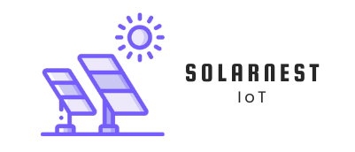

**SolarNest** is an open-source solar panel production and battery monitoring system built for Raspberry Pi, written in Go, with a React dashboard frontend.

### 🚀 Features
- Real-time solar + battery monitoring
- Lightweight Go backend
- React-based local web dashboard
- Runs fully offline
- Designed for small solar setups, RVs / Caravans / Off-Grid 

### 🧰 Tech Stack
- Backend: Go (Golang)
- Frontend: React + Vite
- Hardware: INA219, Victron VE.Direct (in progress)
- Raspberry Pi ready (Zero W, 3, 4)

## 🚀 Getting Started (Raspberry Pi Setup)

### ✅ Requirements

- Raspberry Pi (e.g. Pi Zero 2 W)
- SIM7028 NB-IoT HAT (e.g. Waveshare SIM7028)
- Go 1.23+
- MQTT broker (self-hosted or Fly.io)
- PostgreSQL database (local or Fly.io)

---

### 🧪 Build and Deploy the Agent

1. **Enable UART** in `/boot/config.txt`:
   ```bash
   sudo nano /boot/config.txt
   # Add:
   enable_uart=1
    ```
2. Build the agent for ARM:
    ```bash
    GOARCH=arm GOARM=6 GOOS=linux go build -o solarnest main.go
    ```
3. Create config file:
    ```bash
    mkdir -p ~/.config/solarnest
    nano ~/.config/solarnest/config.json
    ```
    Example config:
    ```json
    {
        "mqtt_server_url": "SERVER_URL",
        "mqtt_topic": "vedirect/data",
        "client_id": "mqtt",
        "serial_name": "/dev/serial0",
        "serial_baud": 115200,
        "interval_minutes": 15
    }
    ```
4. Move the binary to a system path:
    ```bash
    sudo cp solarnest /usr/local/bin/
    ```

## ⚙️ Setup as a systemd service

1. Create the service file:
    ```bash
    sudo nano /etc/systemd/system/solarnest.service
    ```

    And paste this:
    ```bash 
    [Unit]
    Description=Solarnest MQTT Client
    After=network.target

    [Service]
    ExecStart=/usr/local/bin/solarnest
    Restart=always
    User=pi

    [Install]
    WantedBy=multi-user.target
    ```
2. Reload and start:
    ```bash 
    sudo systemctl daemon-reload
    sudo systemctl enable solarnest
    sudo systemctl start solarnest
    ```
3. View logs once started: 
    ```bash
    journalctl -u solarnest -f
    ```

## 🌐 API Endpoints

Run via a Go-based Gin server.

| Endpoint          | Description                   |
|-------------------|-------------------------------|
| `GET /api/ping`   | Health check                  |
| `GET /api/devices`| List all devices and statuses |


## ☁️ Fly.io Deployment

### 🛠 Create Postgres on Fly.io:
```bash
flyctl postgres create --name iot-db
```
### 🔗 Attach DB to App:
```bash
flyctl postgres attach --app solarnest-app --postgres-app iot-db
```

### 🚀 Deploy Your App:
```bash
flyctl deploy
```
## 📋 License

MIT — use freely, contribute openly 💚

## 🤝 Contributing

PRs and contributions are welcome! Feel free to fork, test, and suggest improvements.
